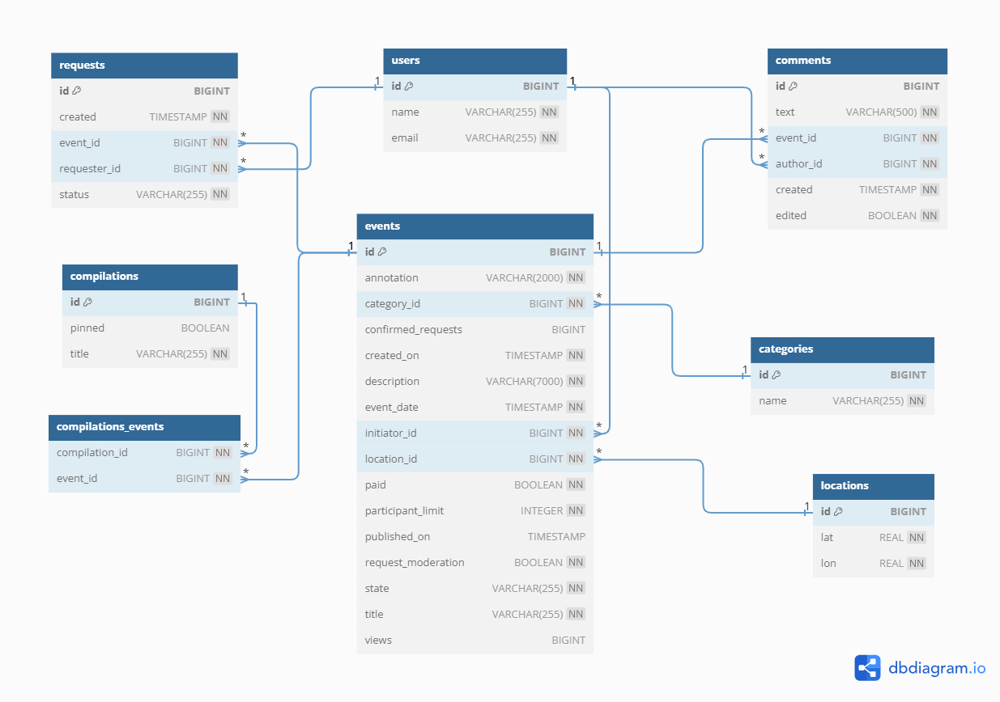

# Explore with me

Дипломный учебный проект. Приложение-афиша, которое позволяет пользователям делиться информацией об интересных
событиях и находить компанию для участия в них.

##### За основу взята микросервисная архитектура, приложение состоит из двух модулей:
* main service - основной сервис, бизнес-логика
* statistics service - сбор и хранение статистики

##### API основного сервиса разделена на три части:
* публичная - доступна без регистрации любому пользователю сети
* приватная - доступна только авторизованным пользователям
* административная — для администраторов сервиса

##### Приложение предоставляет следующие возможности:
* создание пользователя
* создание нового события
* контроль публикации события администратором
* просмотр события
* создание пользователем заявки на участие в событии
* просмотр подборок событий
* комментирование события пользователем
* просмотр статистики публичных просмотров события

### Стек:
* Java 11
* Spring Boot
* Maven
* Lombok
* JPA, Hibernate
* PostgreSQL
* Docker
___
### Запуск проекта

Для работы приложения необходим Docker.

#### 1. Клонировать репозиторий:
```bash
git clone "ссылка на проект"
```
#### 2. Перейти в корневую папку проекта:
```bash
cd java-explore-with-me/
```
#### 3. Запустить приложение через docker-compose
```bash
docker-compose up
```
___

### Swagger-спецификация API (json)
[*Основной сервис*](https://raw.githubusercontent.com/LerikaP/java-explore-with-me/main/ewm-main-service-spec.json)  
[*Сервис статистики*](https://raw.githubusercontent.com/LerikaP/java-explore-with-me/main/ewm-stats-service-spec.json)

Необходимо скопировать ссылку на файл спецификации, затем в [онлайн-версии редактора Swagger](https://editor-next.swagger.io/)
на верхней панели выбрать `File`, затем `Import URL` и вставить скопированную ссылку.

Если установлен плагин OpenAPI (Swagger) Editor для IntelliJ IDEA, необходимо открыть файл ewm-main-service-spec или
ewm-stats-service-spec и на верхей панели нажать `Show OpenAPI preview`,
страница Swagger UI Preview в браузере откроется автоматически.
___

### URL API при локальном запуске
**stats service** `http://localhost:9090`  
**main service** `http://localhost:8080`
___
[*Postman-коллекция*](https://github.com/LerikaP/java-explore-with-me/blob/main/postman/feature.json) с примерами запросов.  
[*Postman-коллекция*](https://github.com/LerikaP/java-explore-with-me/blob/main/postman/main.json) для функционала комментирования с примерами запросов.
___
#### Диаграмма базы данных


